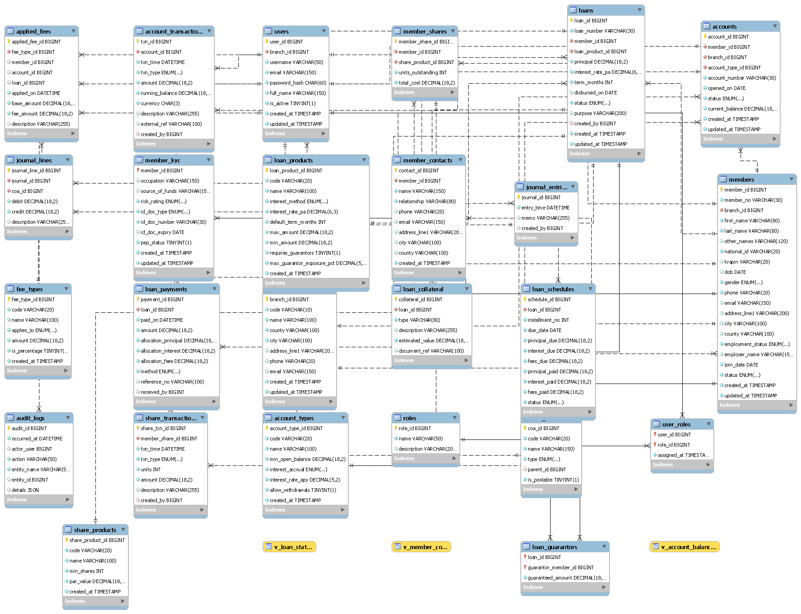

# SACCO Database Management System

This repository contains the **MySQL implementation of a Sacco Database Management System (DBMS)**.  
The system models how a Sacco (Savings and Credit Cooperative) manages members, savings, loans, repayments, and staff.  

## 📌 Features
- Members registration & management  
- Savings accounts with transactions  
- Loan issuance and repayments  
- Staff management & roles  
- Fully normalized relational schema (with PK, FK, constraints)  
- Well-commented SQL script for easy learning  

---

## 📂 Files
- **sacco_db.sql** → MySQL script containing:
  - Database creation  
  - Tables with constraints (PK, FK, UNIQUE, NOT NULL)  
  - Relationships (1–1, 1–M, M–M where applicable)  
  - Sample insert statements for testing  


## 🖼️ ERD (Entity Relationship Diagram)



---

## 🛠️ How to Use
1. Clone this repository:
   ```bash
   git clone https://github.com/<your-username>/sacco_dbms.git
   cd sacco_dbms
